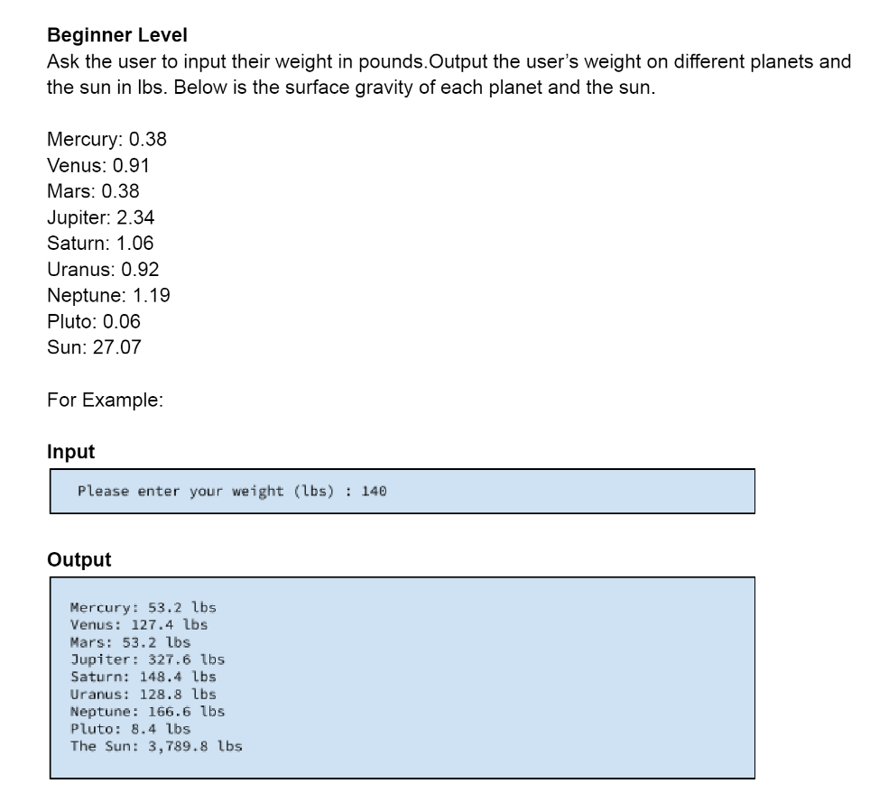

# Title: Coding Challenges in Java
### These are coding challenges that I found online and I coded the solution for them in Java. Check them out in the Coding Challenges folder. 

## My Objective:
Is to help those who are getting started with coding or preparing for their coding interview. Take a look at how I code it and understand each step of the code.

## How to run the code:
1. Clone the repository: https://github.com/skytruong90/Coding_Challenges-Java.git
2. The main codes for all 3 challenges are inside a folder called Coding Challenges.
3. Then run the code with any Java IDE of your choice.

## Beginner Challenge:
The prompt for this one is in the "Beginner_Challege" pdf folder. Just open that one and you will see the prompt.

## Intermediate Challenge:
Write a function that will take a given string and reverse the order of the words, but with a string containing punctuation, output the reverse order of the words, but keep the punctuation in the same space.

## Summary of the Intermediate Challenge Code: 

1. Split the input string into an array of words using the split method with a space delimiter.
2. Iterate over the words in reverse order using a for loop.
3. For each word, find any punctuation at the end of the word and store it in a separate string variable.
4. Append the reversed word (without the punctuation) to a StringBuilder, followed by a space and the stored punctuation.
5. Convert the StringBuilder to a string using the toString method and remove any leading or trailing whitespace using the trim method.

## Expert Challenge:
Given an array of strings, output a binary search tree made up of the strings in an
understandable format.

The properties of a binary search tree
1. All nodes of left subtree are less than the root node
2. All nodes of right subtree are more than the root node
3. Both subtrees of each node are also BSTs i.e. they have the above two properties
Hint: The root is the middle element
You can assume the input will always be a string containing letters and punctuation separated by a single space.

## What I have learned: 
1. How to think and analyze the question.
2. Using what I know and pick a program that I feel comfort working with.
3. The difference between harder questions and easier questions is the time in preparing how to code it and how to structure the code.

## Summary of the Expert Challenge Code: 
The program defines a Node class for the nodes of the binary search tree. Each node contains a String value and pointers to its left and right children. The BinarySearchTree class defines the root node and provides methods to insert nodes and print the tree in order.

To insert a new node into the tree, the program uses a recursive approach. The insertRecursive method compares the new string to the current node's string value and decides whether to insert it into the left or right subtree. If the current node is null, the new node is inserted as the root.

To print the tree in order, the program uses another recursive method printInOrderRecursive. This method traverses the tree in order (left subtree, root, right subtree) and prints the string value of each node.

The main method creates a ChallengeOne object, inserts the strings from the input array, and prints the tree in order.
